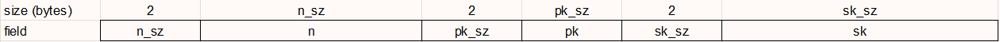
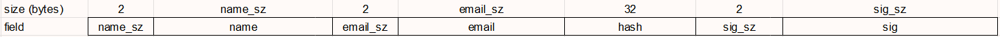
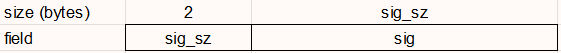

# Digital certificates

Digital certificates is a set of tools that creates digital certificates, and makes use of them. The tools are:

- Generate: Generates new certificates.
- Sign: Signs files using certificates.
- Verify: Verifies signatures of certificates and files.

---

## 1. Dependencies

To compile the repository you need:

- [C++ >=17 compiler](https://gcc.gnu.org/)
- [CMake >=3.0](https://cmake.org/)
- [GNU Make](https://www.gnu.org/software/make/)
- [LibreSSL](https://www.libressl.org/)

The repository contains FireCPP as a submodule.

## 2. Download Instructions

To clone and compile the repository you need to:

```sh
git clone https://github.com/northy/digital-certificates.git --recurse-submodules
cd digital-certificates && mkdir build && cd build && cmake ..
make -j
```

## 3. Project structure

The project is structured as follows:

| Folder   | Content               |
|----------|-----------------------|
| app/     | Tools source code     |
| include/ | Header files          |
| src/     | Source routines files |

## 4. Project details

### 4.1 Terminology

- hash: function that maps data of arbitrary size to fixed-size values.
- [SHA](https://en.wikipedia.org/wiki/Secure_Hash_Algorithms): family of cryptographic hash functions. (This project uses SHA256)
- [RSA](https://en.wikipedia.org/wiki/RSA_(cryptosystem)): Rivest-Shamir-Adleman public-key cryptosystem. (This project uses RSA2048)
- n: The RSA module.
- pk: The RSA e field.
- sk: The RSA d field.
- Public key: The combination of n and pk.
- Secret key: The combination of n and sk.
- sig: RSA signature.

### 4.2 Tools

#### Generate

This tool generates new certificates. Those certificates can be:

- Self-signed certificate: Signs the certificate with it's own private key.
- Associated key signed certificate: Signs the certificate with an associated certificate's key.

The tool generates two files, the certificate, and the certificate's private file (Certificate file), having the same name as the certificate but with a leading ".sk" extension (Secret key file).

Run arguments are:

| Argument | Description                     | Required           |
|----------|---------------------------------|--------------------|
| -s       | Self signed certificate?        | No                 |
| -o       | Output file path                | Yes                |
| -k       | Associated certificate key file | If not self-signed |

Example:

```sh
./Generate -o out.cert -s
./Generate -o out.cert -k signer.cert.sk
```

#### Sign

This tool digitally signs files.

The tool generates one file, having the same name as the input file but with a leading ".sig" extension (Signature file).

Run arguments are:

| Argument | Description                     | Required           |
|----------|---------------------------------|--------------------|
| -s       | Secret key path                 | Yes                |
| -f       | File to sign                    | Yes                |

Example:

```sh
./Sign -s out.cert.sk -f file.ext
```

#### Verify

This tool verifies signatures. It can verify certificate's signatures, or file signatures.

Run arguments are:

| Argument | Description             | Required         |
|----------|-------------------------|------------------|
| -c       | Certificate Path        | Yes              |
| -s       | Signer certificate path | If -f is not set |
| -f       | File to check           | If -s is not set |

Note: There must exist a .sig file for the file provided in -f.

Example:

```sh
./Verify -c out.cert -f file.ext
./Verify -c out.cert -s signer.cert
```

### 4.3 Files

There are three types of generated files:

#### Secret key file:

The secret key file structure is as follows:



#### Certificate file:

The certificate file structure is as follows:



#### Signature file:

The signature file structure is as follows:



